# Sensor configuration analysis

The capacitive sensor that the team is building must have different configurations to adjust the sensitivity. These experiments are run with different configuations to identify the correct circuit for different locations.

## Findings

| Test | Resistor | Capacitor | Touch | Proximity |
| ---- | -------- | --------- | ----- | --------- |
| 00   | 100k     | -         | 🚫    | 🚫        |
| 01   | 100k     | 221k      | ✅    | 🚫        |
| 02   | 100k     | 680k      | ✅    | 🚫        |
| 03   | 100k     | 560k      | ✅    | 🚫        |
| 04   | 10M      | -         | ✅    | 🚫        |
| 05   | 10M      | 221k      | ✅    | 🚫        |
| 06   | 10M      | 681k      | ✅    | 🚫        |
| 07   | 20M      | -         | ✅    | 🚫        |
| 08   | 20M      | 221k      | ✅    | 🟡        |
| 09   | 20M      | 681k      | ✅    | 🟡        |
| 10   | 30M      | -         | ✅    | 🟡        |
| 11   | 30M      | 221k      | ✅    | 🟡        |
| 12   | 50M      | 221k      | ✅    | ✅        |
| 13   | 50M      | 681k      | 🚫    | 🚫        |
| 14   | 80M      | 221k      | ✅    | ✅        |
| 15   | 80M      | 681k      | 🚫    | 🚫        |

## Data logs
### Test 00

### Test 01
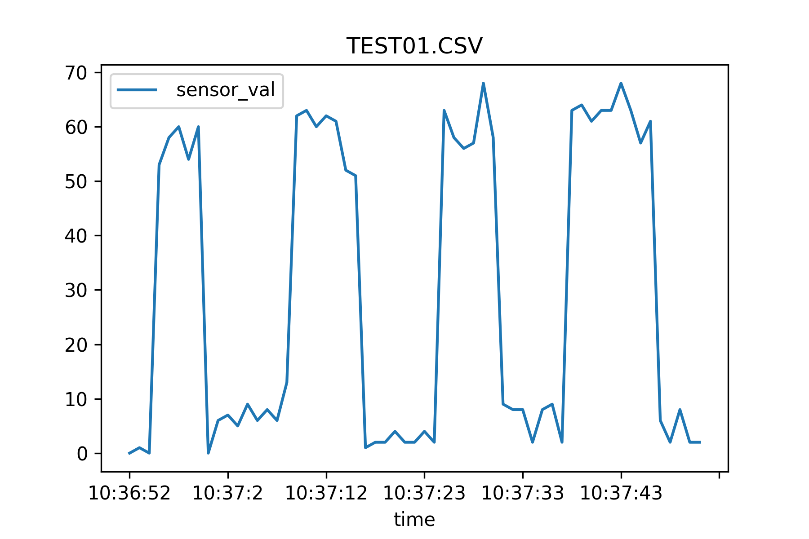

### Test 02
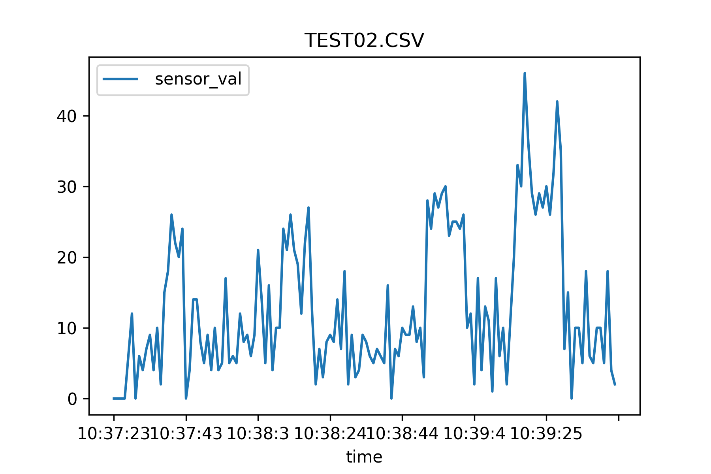

### Test 03
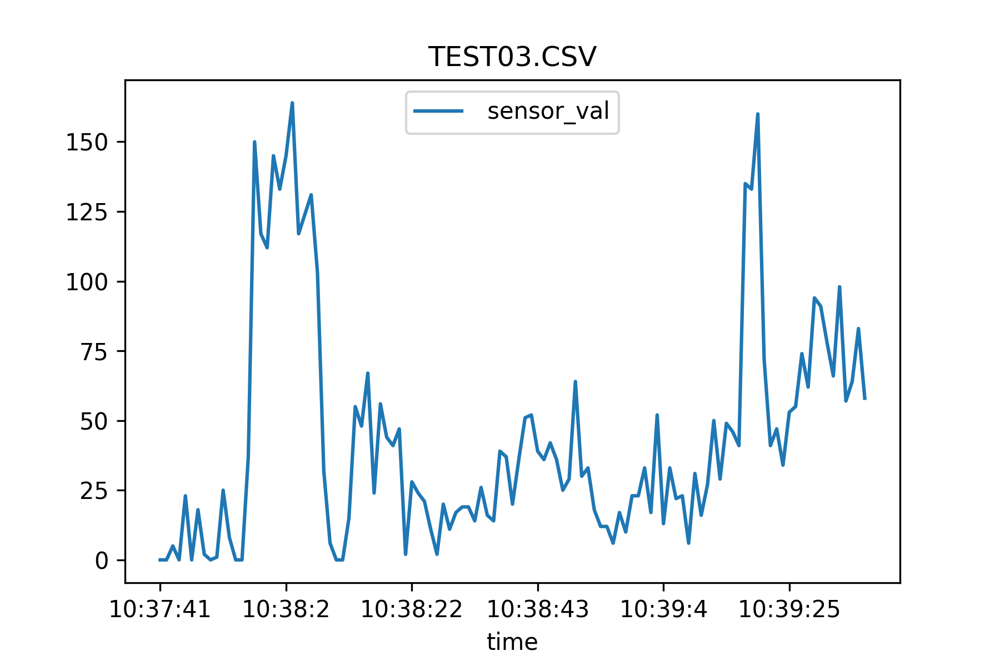

### Test 04

### Test 05
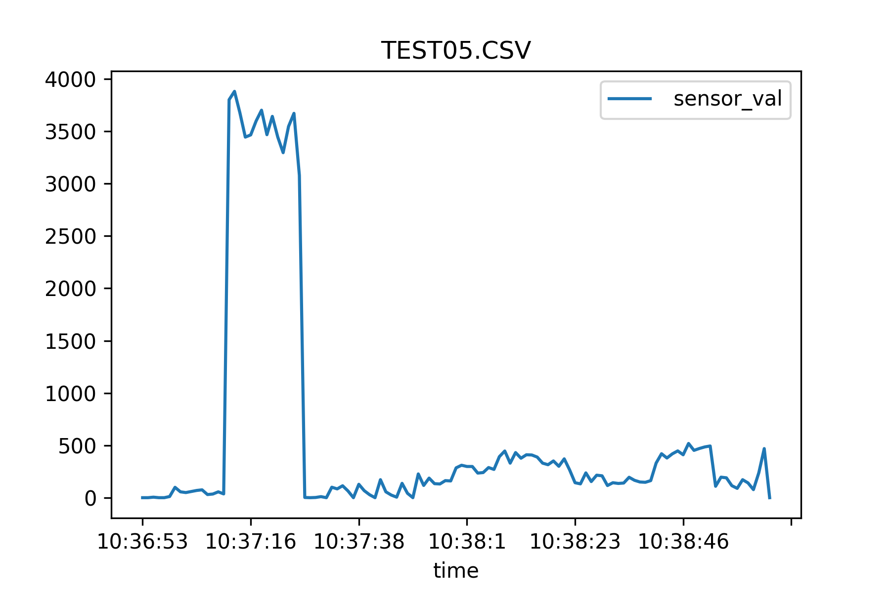

### Test 06

### Test 07
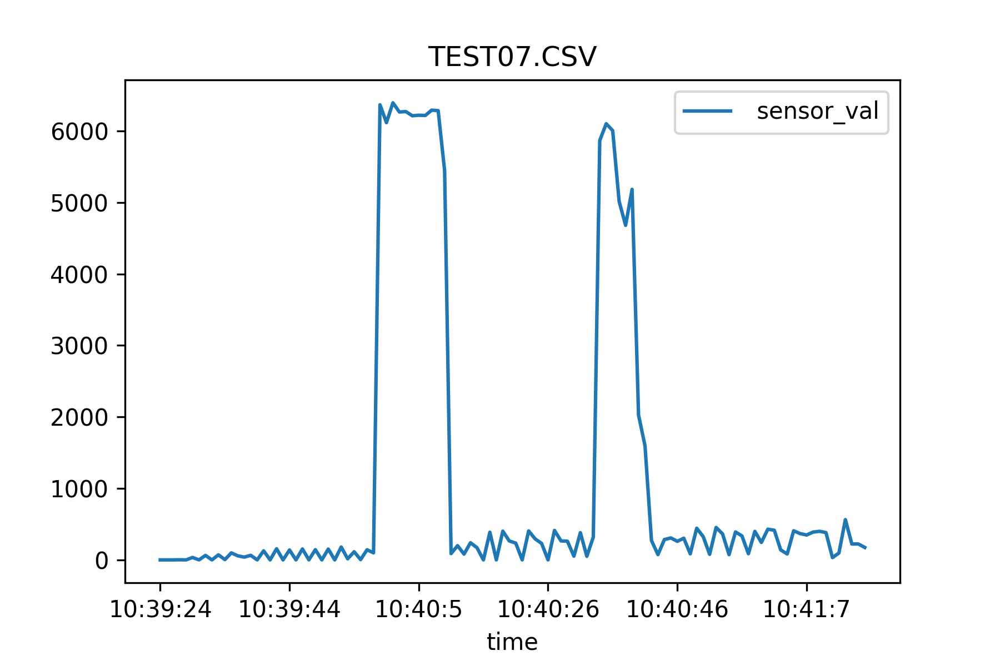

### Test 08
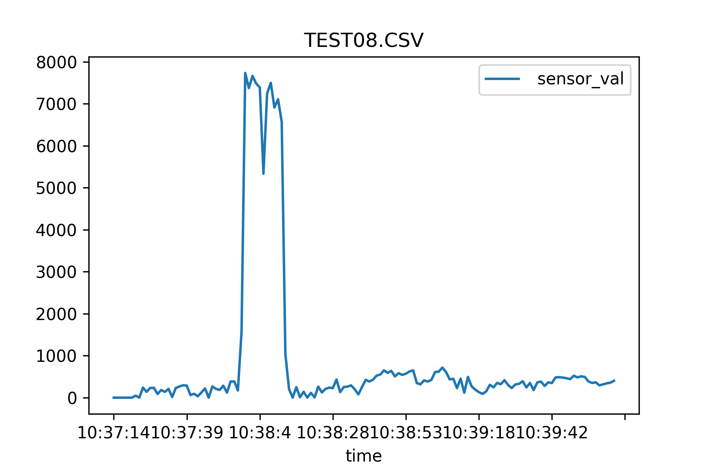

### Test 09
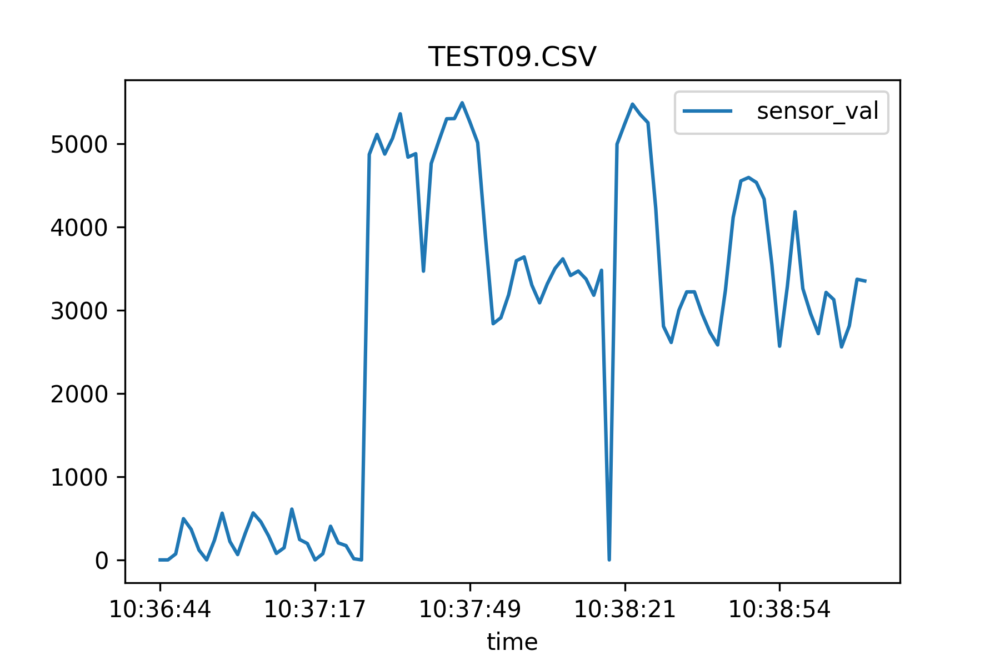

### Test 10

### Test 11
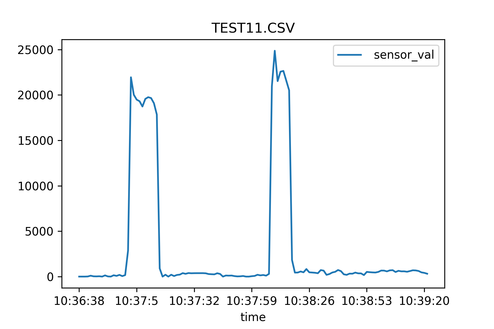

### Test 12
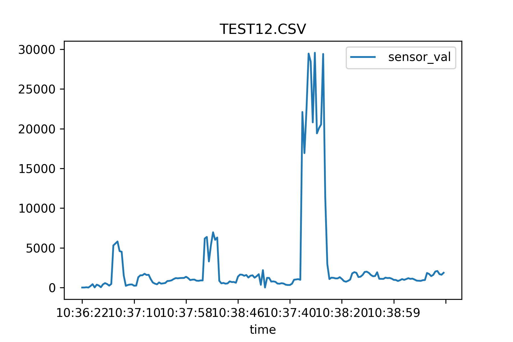

### Test 13
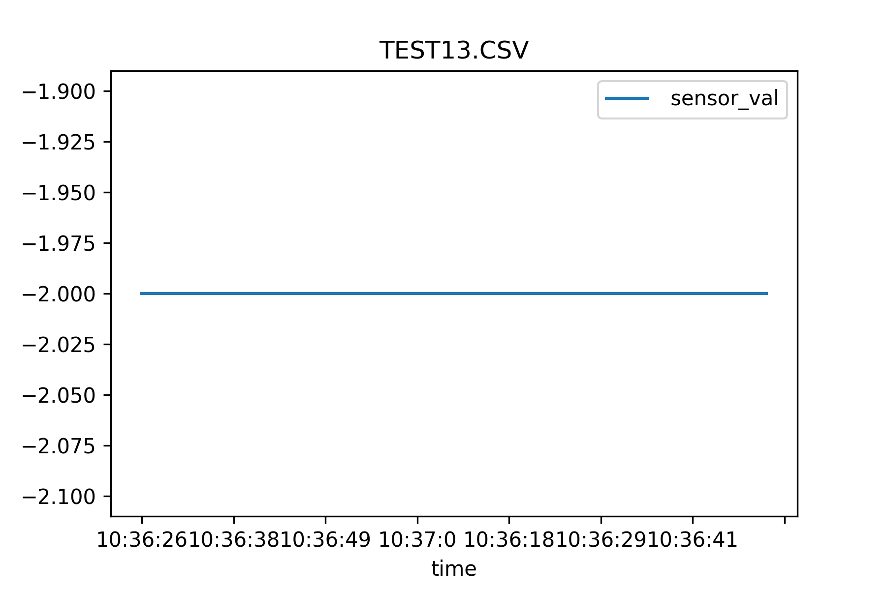

### Test 14
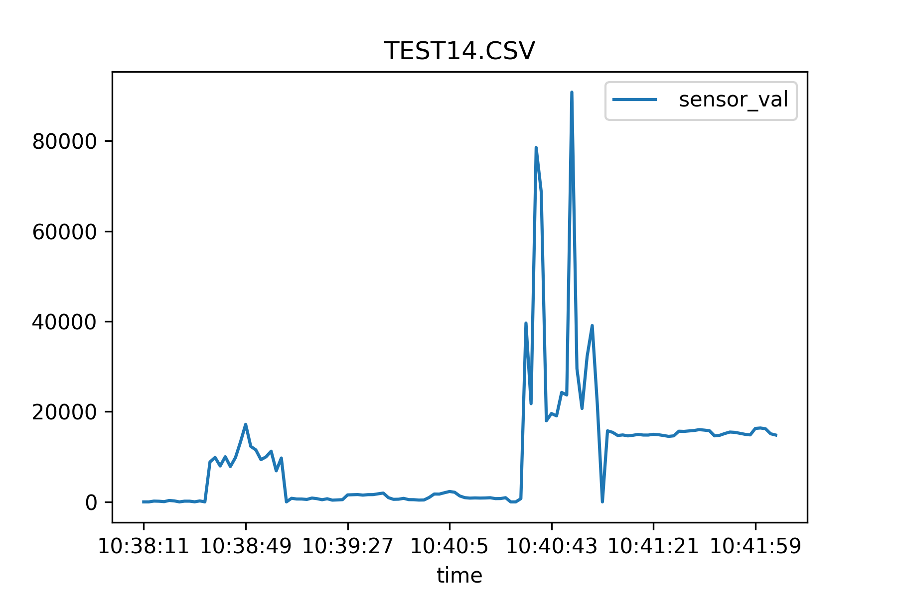

### Test 15
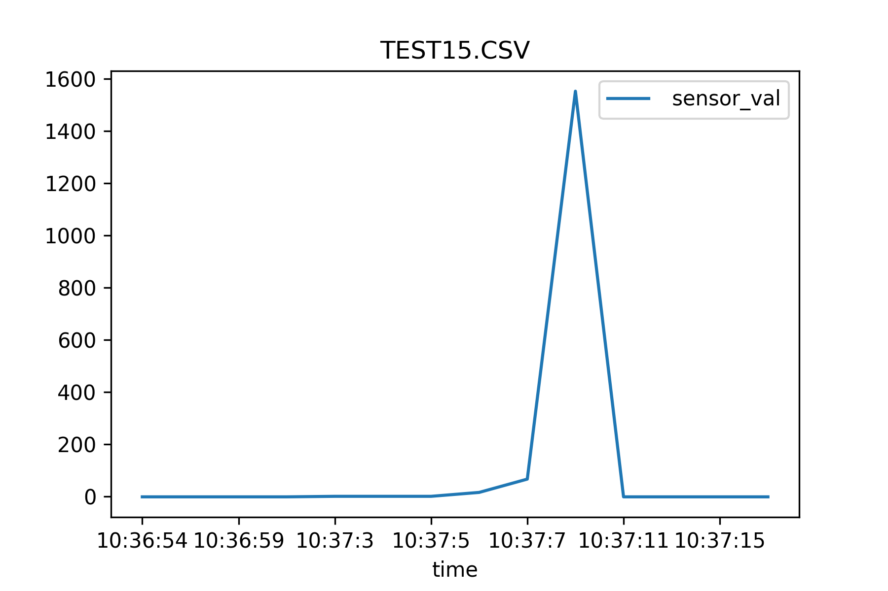
